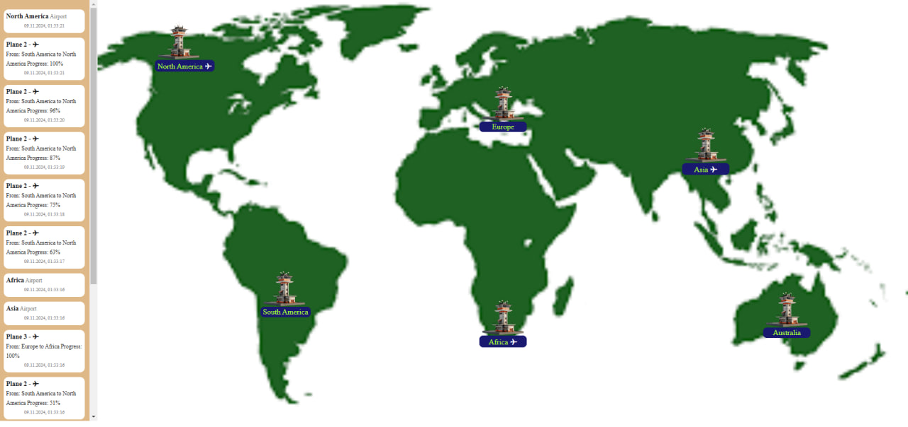
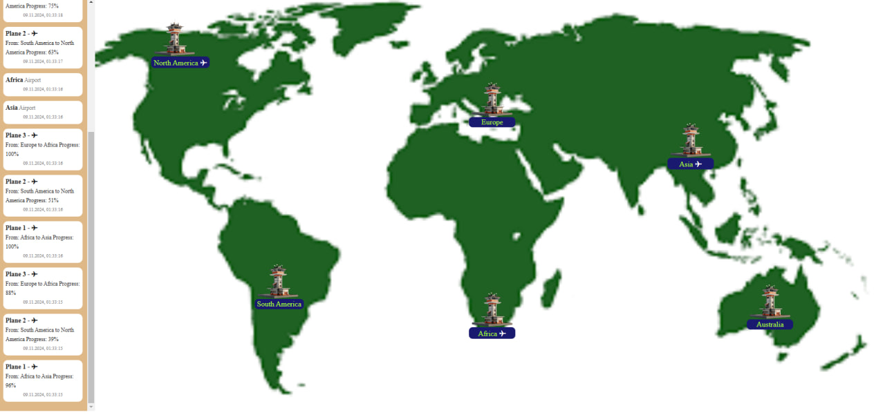
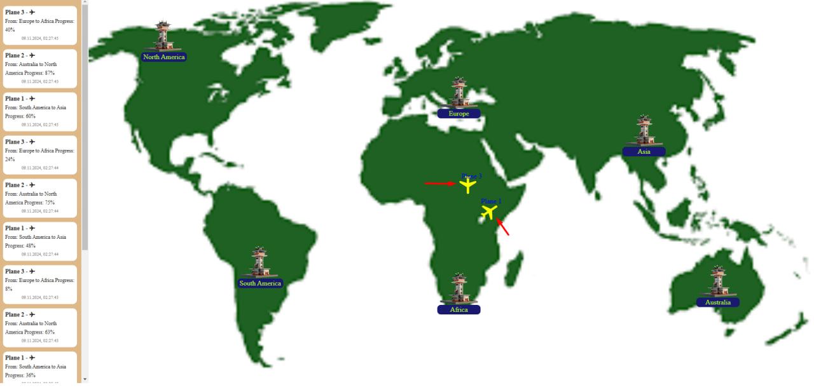

# Airport Control Room Microservices Application

This project is a simple microservices-based architecture for Airport Control Room management. The application
includes two services that communicate with each other through messages, using a shared module of basic 
models and their specific properties. The airplane is represented as messages on its route, where the
route is a segment from one airport to another. To calculate location, we use the Bezier Curve
formula B(t) = (1 - t)P0 + tP1, where t ∈ [0,1], showing the progress as a percentage of the completed
route. This model is not designed for real-world applications, as it does not account for 3D routing,
wind force, humidity, wind resistance, flight direction, turbulence, speed changes, changes in aircraft
mass due to fuel consumption, air temperature, or pilot mood.

The application demonstrates the capability to work with the reliable Kafka message broker and shows the
ability to send and receive data in a simplified form without implementing reliability and idempotency strategies.

## Architecture

The project is built using microservices and deployed with `Docker Compose`. Each microservice is 
responsible for specific functionality, with Kafka as the messaging system for inter-service communication.

### Components

- **Zookeeper**: Coordination for Kafka.
- **Kafka**: Message broker for event exchange between microservices.
- **Office Service**: Manages the core office management logic.
- **Plane Service**: Handles specific aspects of logistics or resources.
- **UI (Frontend)**: User interface built with Nuxt.js and Vue.js.

## Technologies Used

### 1. Docker and Docker Compose
- **Docker** allows each component to run in separate containers, simplifying environment setup and management.
- **Docker Compose** is used to launch all necessary services simultaneously, including Zookeeper, Kafka, and
- the Office and Plane microservices.

### 2. Kafka (and Zookeeper)
- **Kafka** is a messaging system for processing and transmitting events between services.
- **Zookeeper** is used for Kafka cluster coordination.
- These services are defined in `docker-compose.yml` for fast deployment and setup.

### 3. Spring Boot (Backend)
- Each service (Office and Plane) is built with **Spring Boot** for rapid development and scalability.
- **Kafka** is integrated via the `spring-kafka` library, enabling easy sending and receiving of messages between services.
- **Caffeine Cache** is used for request caching and data processing acceleration.
- Lightweight libraries such as **Lombok** are used to reduce boilerplate code.

### 4. Nuxt.js and Vue.js (Frontend)
- **Nuxt.js** is used to build the user interface, providing SSR (server-side rendering) to improve performance and SEO.
- **Axios** is integrated to simplify HTTP requests and data exchange with backend services.

## Images:

### 1. Messages example 1:



### 2. Messages example 2:



### 3. Planes example:



## Project Structure

### Backend Services

#### Office Service
- Uses Spring Boot, with controllers to handle user requests.
- **Caffeine-based** caching to boost performance.
- This microservice is responsible for office data management logic.

#### Plane Service
- Module for specific logistics logic.
- Uses Kafka for event exchange with other services.

### Frontend
- **UI**: Built with Nuxt.js, interacts with the backend, enabling real-time data display and efficient interface management.

## Running the Application

### Prerequisites

- Docker and Docker Compose

### Commands to Run

1. Start `Docker Compose`:
    ```bash
    docker-compose up -d
    ```

2. UI:
   ```bash
   cd ui
   npm install
   npm run dev


